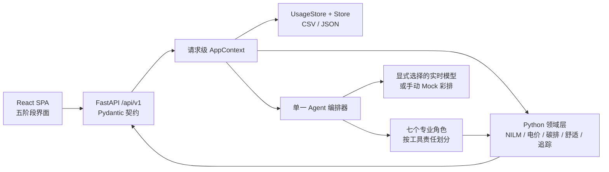

# HomeShift AI

> **Cut bills, not comfort.** —— Agentic AI in Sustainability 课程项目

一个面向家庭能源管理的**智能体系统**：读取真实的半小时电表数据与气温，自主完成
**诊断 → 规划 → 执行建议 → 追踪 → 反思调整** 的完整闭环，生成可解释、可执行、
可持续调整的个性化节能计划。

**目标用户**：想降低电费和碳排、但没有能源专业知识的家庭。

**一句话定位**：**Agentic AI + Household Energy Copilot（家庭能源智能副驾）**。

当前 CDS 版本采用 **Python 领域层 + FastAPI + 解耦 Vite SPA**。Python 是所有业务
数字的唯一事实来源；React 只负责交互与可视化，不复制能源公式。

---

## 快速启动 Web Demo

### 环境要求

- Python 3.10 或更高版本
- Node.js 20.19+ 或 22.12+
- Windows PowerShell、macOS 或 Linux

### 1. 启动 Python API

在项目根目录执行：

```powershell
python -m pip install -r requirements.txt
python -m uvicorn homeshift.api:app --host 127.0.0.1 --port 8000
```

后端启动成功后：

- `http://127.0.0.1:8000`：自动跳转到 API 文档
- `http://127.0.0.1:8000/docs`：FastAPI 交互式接口文档
- `http://127.0.0.1:8000/api/v1/status`：运行状态

### 2. 启动解耦前端

另开一个终端：

```powershell
cd frontend
npm.cmd install
npm.cmd run dev
```

浏览器打开 `http://127.0.0.1:5173`。

> Windows PowerShell 如果提示“禁止运行 `npm.ps1`”，直接使用上面的
> `npm.cmd` 即可，不需要降低系统执行策略。macOS/Linux 使用 `npm`。

### 3. 完整跑通一次

1. 在 **Data** 页选择合成数据彩排，或上传 SP Group/通用 CSV。
2. 审核系统推断的家庭画像和舒适约束。
3. 在模型面板显式选择已配置的实时模型；没有密钥时可手动选择 Mock。
4. 依次完成 **Diagnosis → Plan → 用户确认提交**。
5. 在 **Track** 中选择“演示快进一周”或上传真实实施后 CSV，再运行复盘。

Mock 只模拟“LLM 决定下一步调用哪个工具”的过程；NILM、费用、碳排、舒适否决、
候选收益和追踪计算仍全部运行真实 Python 代码。实时模型失败时 Web 不会自动降级
或伪装成功。

---

## 30 秒看懂

普通能源 App 只会说"这个月用了 543 度电"。HomeShift AI 会说：

1. **为什么高** —— "冰箱占 26.7%、待机负载占 19.3%，你家白天没人时仍有持续的
   热水器保温损耗"（负载分解诊断，误差可对照分表真值定量验证）
2. **怎么办** —— "做这 4 件事，每月省 19.21 元，不牺牲任何舒适度"
   （量化计划，且**有一个角色专门负责否决那些会牺牲舒适的省钱方案**）
3. **做得怎么样** —— "剔除气温变化后你真省了 0.8 kWh/天；但冰箱那条的达成率
   显示 1100%，这不可信，更可能是负载分解的归类误差，请以总体数字为准"
   （天气归一化追踪 + 归因可信度自检）

三步分别对应 Agentic AI 的**感知与分析、规划与行动、反思与记忆**。

---


### 路线 A：用真实数据（推荐，答辩用这条）

```bash
# 1. 一条命令搞定：下载真实数据集 -> 解析 -> 拉真实气温 -> 写入项目
python fetch_real_data.py

# 2. 看看数据是否就位
python -m homeshift status

# 3. Agent 诊断 -> 规划 -> 复盘
python -m homeshift diagnose
python -m homeshift plan
python -m homeshift simulate-week      # 演示用：快进一周执行后的数据
python -m homeshift review

# 4. 导出给可视化网站
python -m homeshift export-web

# 5. 用真实分表数据验证负载分解到底准不准
python -m homeshift eval-disagg
```

`fetch_real_data.py` 全自动，**不需要你懂任何数据处理**。它会下载数据集
（多镜像、断点续传、进度条）、重采样到半小时、拉取同地点同时段的真实气温、
挑一段完整度最高的连续窗口、从用电曲线反推家庭画像、记录数据出处，
并把地区/币种/电价/碳因子写回配置。

### 路线 B：不联网，用合成数据（课堂应急）

```bash
python -m homeshift init
python -m homeshift diagnose
```

---

## 真实数据从哪来

| 数据集 | 内容 | 为什么选它 |
| --- | --- | --- |
| `uci`（默认） | 法国单户，1 分钟粒度，2006–2010，**含 3 路分表** | 唯一免密钥、自带分电器真值的公开数据集 —— 能**定量验证**我们的负载分解算法 |
| `spgroup` | 你自己家的 SP Group 导出 CSV | 最贴近产品真实场景（新加坡 HDB + 半小时总表） |
| `csv` | 任意"时间 + 用电量"两列的 CSV | 接 Ausgrid、Low Carbon London 或老师给的任何数据 |

气温统一来自 **Open-Meteo Historical Weather API**（ERA5 再分析，免密钥，
全球任意坐标，1940 年至今）。这保证了无论用哪国的电表数据，都能拿到
**同地点、同时段**的真实气温 —— 天气归一化才站得住脚。
新加坡场景可改用 `--weather datagovsg` 拉 data.gov.sg 的实测观测站数据。

```bash
python fetch_real_data.py --list                    # 看有哪些数据集
python fetch_real_data.py --dataset spgroup --file data/raw/my_meter.csv
python fetch_real_data.py --dataset csv --file x.csv --time-col 时间 --value-col 电量
python fetch_real_data.py --days 90 --weather none  # 换窗口长度 / 关闭天气
```


---

## 换模型：一行配置

系统对 LLM 的依赖被抽象到一层接口后面，**换模型不需要改 Agent 一行代码**。

```bash
python -m homeshift providers    # 列出所有提供方与密钥状态
python -m homeshift llm-test     # 测试当前模型能不能正确调用工具
```

用 DeepSeek：

```bash
export DEEPSEEK_API_KEY=sk-xxxx          # Windows: $env:DEEPSEEK_API_KEY="sk-xxxx"
echo '{"llm": {"provider": "deepseek"}}' > config.json
python -m homeshift diagnose
```

| provider | 说明 |
| --- | --- |
| `mock` | 离线剧本，零依赖零成本；Web 中必须由用户显式选择 |
| `anthropic` | Claude 原生 Messages API |
| `deepseek` | 模型 `deepseek-v4-pro` / `deepseek-v4-flash` |
| `openai` / `qwen` / `kimi` / `zhipu` / `siliconflow` / `openrouter` | OpenAI 兼容 |
| `ollama` | 本地模型，离线免费不上传数据 |
| `custom` | 任意 OpenAI 兼容网关（自填 base_url） |

> **注意**：DeepSeek 的旧模型名 `deepseek-chat` 与 `deepseek-reasoner` 已于
> **2026-07-24 下线**，网上的老教程会让你拿到 404。本项目已使用新模型名。


---

## 七个专家角色

网站对外的叙事是「7 个 specialist agents 协作」。这**不是包装** —— 每个工具都
归属于一个角色，每次调用都会记录"谁出手、看到什么、产出什么"，形成可审计的
协作轨迹；其中**舒适守门人持有否决权**，是唯一能推翻其他角色结论的角色。

```bash
python -m homeshift agents      # 查看花名册，并自检"有没有工具没被认领"
```

| # | 角色 | 职责 | 工具 |
| --- | --- | --- | --- |
| 1 | 数据管家 Data Steward | 收齐证据并检查质量 | 画像 / 用电 / 天气 |
| 2 | 负载侦探 Load Detective | 把总表拆成分类别用电（NILM） | 负载分解 |
| 3 | 成本分析师 Cost Analyst | kWh → 钱 | 电价 |
| 4 | 碳排分析师 Carbon Analyst | kWh → CO2 | 碳因子 |
| 5 | **舒适守门人 Comfort Guardian** | **否决违反舒适约束的动作** | （作用于他人产物） |
| 6 | 规划师 Planner | 量化候选、挑组合、落成计划 | 模拟 / 保存 / 读取计划 |
| 7 | 追踪与记忆 Tracker & Memory | 归一化后测量真实效果并记住 | 追踪 / 反馈 / 记忆 |

架构是 **单编排器 + 七个专职角色**：一个 LLM 循环决定下一个该谁出手，
所有数字由角色对应的确定性工具算出 —— 模型不产生数字。

---

## 全部命令

| 命令 | 说明 |
| --- | --- |
| `python fetch_real_data.py` | **接入真实数据（一键，推荐）** |
| `python -m homeshift init` | 生成合成演示数据 |
| `python -m homeshift init-real` | 等价于 fetch_real_data.py |
| `python -m homeshift status` | 系统状态：模型、数据来源、地区、计划 |
| `python -m homeshift diagnose` | [Agent] 用电诊断 |
| `python -m homeshift plan` | [Agent] 制定节能计划 |
| `python -m homeshift simulate-week` | 快进一周执行数据（演示用） |
| `python -m homeshift review` | [Agent] 周度复盘 |
| `python -m homeshift chat` | 自由对话 |
| `python -m homeshift report` | 生成 HTML 周报 |
| `python -m homeshift export-web` | **导出网站数据包** |
| `python -m homeshift eval-disagg` | 对照分表真值评估分解精度 |
| `python -m homeshift providers` | 列出可用模型提供方 |
| `python -m homeshift llm-test` | 测试模型连通性与工具调用 |
| `python -m homeshift agents` | 查看七个角色 |
| `python -m unittest` | 运行 Python 测试套件（47 个） |

---

## 目录结构

```
homeshift/
├── __main__.py        CLI 入口（15 个命令）
├── api.py             FastAPI Web 入口与 /api/v1 公共接口
├── api_models.py      Pydantic 写操作契约
├── api_runtime.py     请求级上下文、显式模型路由、提案隔离
├── config.py          全局配置（config.json 可覆盖任意字段）
├── context.py         应用上下文
├── agent/
│   ├── core.py        Agent 核心：tool-use 循环 + 护栏 + 角色轨迹
│   ├── roles.py       七个专家角色的定义与工具归属（含自检）
│   ├── prompts.py     系统提示词与任务提示词
│   └── tools.py       12 个工具的 Schema 与执行
├── llm/
│   ├── base.py            LLM 抽象接口
│   ├── registry.py        提供方注册表（11 种）与配置解析
│   ├── anthropic_client.py Claude 原生（SDK 可选，无 SDK 走内置 HTTP）
│   ├── openai_compat.py   OpenAI 兼容协议 + 双向格式翻译
│   └── mock_client.py     离线剧本（报告完全数据驱动）
├── domain/            确定性计算引擎
│   ├── disaggregate.py  负载分解（NILM，作息锚点可配置）
│   ├── simulate.py      节能动作模拟器
│   ├── comfort.py       舒适约束与否决权
│   ├── tracker.py       效果追踪（天气归一化 + 归因可信度）
│   ├── tariff.py        电价（多币种）
│   └── carbon.py        碳排换算
├── realdata/          真实数据接入
│   ├── sources.py       数据集注册表
│   ├── download.py      多镜像下载 + 断点续传
│   ├── loaders.py       UCI / 通用 CSV 解析与重采样
│   ├── weather.py       Open-Meteo / data.gov.sg
│   └── pipeline.py      端到端流水线
├── export/
│   └── web_payload.py 网站数据包（双语、含字段说明书）
├── datastore/         持久层
├── datagen/           合成数据生成器
├── connectors/        实时 API 预留接口
└── report/            HTML 周报
frontend/              解耦的 Vite + React + TypeScript SPA
├── src/api.ts           Zod 响应契约与 API 客户端
├── src/App.tsx          五阶段产品流程、模型/Trace/Chat 抽屉
├── src/styles.css       原视觉语言的响应式实现
└── e2e/                 Playwright 隔离式完整闭环测试
fetch_real_data.py     一键真实数据脚本
tests/                 Python 单元与 API 测试（47 个）
docs/                  详细文档
```

---

## Web Demo：解耦前端 + Python 单一事实源

新前端位于 `frontend/`，是一个独立的 Vite SPA。它不导入旧 TypeScript 项目的
能源公式，也不在运行时读取 `data/web/*.json`；所有业务状态都通过 FastAPI
从当前 Python 工作空间实时组装。

### 本地启动

```powershell
# 终端 1：Python API
python -m pip install -r requirements.txt
python -m uvicorn homeshift.api:app --host 127.0.0.1 --port 8000

# 终端 2：React SPA
cd frontend
npm.cmd install
npm.cmd run dev
```

浏览器打开 `http://127.0.0.1:5173`。API 文档位于
`http://127.0.0.1:8000/docs`。

### 运行架构



这里的“七角色”不是七个各自随意说话的大模型实例，而是一个编排器中的七种
**责任边界**：数据管家、负载侦探、成本分析师、碳排分析师、舒适守门人、
规划师、追踪与记忆。工具归属可以审计，Comfort Guardian 拥有唯一否决权。
这种实现比“多个模型轮流输出一段文本”更稳定，也让每一步能追溯到工具证据。

### 五阶段闭环

1. **Data**：选择 UCI、SP Group、通用 CSV 或合成家庭；完成列识别、单位换算、
   天气接入、出处记录和画像审核。换家庭必须确认，确认后清空旧计划、记忆、
   复盘和 Trace。
2. **Baseline**：展示月度折算、日均、电费、碳排、48 时段平均曲线、逐日用电与
   气温、证据文件和质量局限。币种跟随当前地区。
3. **Diagnosis**：Python 先完成六类 NILM 和前三项数据发现；Agent 再调用工具解释。
   有分表真值时展示 MAE，没有时明确说明无法定量验证。
4. **Plan**：展示全部候选动作和 Comfort Guardian 否决项。Agent 只能产生不落盘
   的建议草案；用户增删并点击确认后，`plan/commit` 才生成正式版本与七日计划。
5. **Track**：可明确选择“合成实施后数据”快进，或追加真实实施后 CSV。天气归一化
   复盘会标记 `not_measurable` / 异常归因，并只把可靠结论写入长期记忆。

### 关键状态边界

| 边界 | 实现 |
| --- | --- |
| 数字归属 | kWh、金额、CO₂、NILM、候选收益和追踪全部由 Python 计算 |
| 模型选择 | 网页只列出环境变量已配置的提供方，不接收、不保存、不回显 API Key |
| Mock | 只有用户主动选择才启用；实时模型失败不会自动降级或伪装成功 |
| 规划与提交 | Agent 提案使用内存代理 Store，不写文件；用户确认后才保存计划 |
| Trace | API 响应只带本次运行；旧累计格式不作为“本次工作记录”展示 |
| 新家庭导入 | 清空旧计划、记忆、复盘、报告、追踪标记和 Agent Trace |
| 实施后数据 | 模拟与真实上传使用不同标记；真实上传只追加，不覆盖基线 |
| 工作空间 | 单一当前家庭；不做账号、多租户和数据库 |

### 公共接口

| 方法 | 路径 | 作用 |
| --- | --- | --- |
| `GET` | `/api/v1/status` | 数据、地区、计划、记忆和模型状态 |
| `GET` | `/api/v1/providers` | 可用提供方及是否配置，不返回密钥 |
| `PUT` | `/api/v1/settings/model` | 显式选择实时模型或 Mock |
| `GET/POST` | `/api/v1/datasets`、`/datasets/import` | 注册数据集与文件导入 |
| `GET/PUT` | `/api/v1/profile` | 审核、编辑家庭画像与舒适约束 |
| `GET` | `/api/v1/workspace` | 实时组装五阶段工作空间 |
| `POST` | `/api/v1/diagnose` | 运行本次诊断 Agent |
| `POST` | `/api/v1/plan/propose` | 生成不落盘的动作建议 |
| `POST` | `/api/v1/plan/commit` | 用户确认后保存正式计划 |
| `POST` | `/api/v1/tracking/simulate-week` | 生成有醒目标记的合成实施后数据 |
| `POST` | `/api/v1/tracking/import` | 追加真实实施后 CSV |
| `POST` | `/api/v1/review` | 天气归一化复盘与长期记忆 |
| `POST` | `/api/v1/chat` | 继承当前家庭、计划和记忆的对话 |
| `GET` | `/api/v1/report` | 生成并下载 HTML 周报 |

### 核心创新与思考

**1. LLM 不拥有数字。** 大模型擅长解释、取舍和把专业结果翻译成行动，但不适合
做可审计计算。本项目把语言推理与能源计算拆开：模型决定“该调用什么工具”，
Python 决定“数字是多少”。

**2. 舒适不是软评分，而是可否决的硬约束。** 很多节能系统只按最大收益排序，
把舒适影响写成一行小字。HomeShift 把舒适守门人放在计划进入用户视野前，
被否决动作仍保留理由和主动放弃的收益，取舍因此透明。

**3. “建议”与“正式计划”在系统层隔离。** Agent 的规划工具在 Web 流程中被
请求级代理截获，只形成草案。计划版本的产生必须经过用户确认，而不是依赖提示词
要求模型“不要乱保存”。

**4. 追踪不把天气变化冒充节能成效。** 系统以制冷/温控度时做归一化，再比较
“若不行动的天气归一化预期”与实际用电；分动作异常达成率不会被包装成超额成功。

**5. 记忆是结构化、可审计的结论，不是无限增长的聊天上下文。** 只有用户反馈或
复盘得出的可靠洞察进入 `memory.json`，下一轮计划会主动读取它。

### 验证命令

```powershell
# Python：原领域测试 + API/隔离/动态地区测试
python -m unittest -v

# Frontend：静态检查、契约与组件测试、生产构建
cd frontend
npm.cmd run lint
npm.cmd test
npm.cmd run build

# 完整隔离流程：临时工作空间，不触碰项目 data/
npm.cmd run test:e2e
```

Playwright 流程覆盖：显式选择 Mock → 导入合成家庭 → Agent 诊断 → 建议草案 →
用户确认提交 → 合成快进一周 → 天气归一化复盘。测试 API 使用临时目录，因此不会
修改当前 UCI/SP Group 数据、正式计划或长期记忆。

---

## 设计原则

**LLM 负责推理与决策，工具负责事实与计算。**

所有 kWh、金额、CO2 数字都来自确定性计算（可复算、可审计），大模型不允许编造数字。
这条原则不只是写在提示词里 —— 离线 Mock 模式的报告模板也被改造成完全数据驱动，
措辞随实际占比变化，不会出现"空调是绝对大头"却显示 3.3% 这种自相矛盾。

**诚实优于好看。** 系统会主动说出自己不知道的事：

- 天气数据覆盖不足时，明确告诉你"本次未做天气归一化，数字包含气温影响"
- 分动作达成率异常（如 1100%）时，标记为"归因不可信，更可能是分解误差"
- 没有分表真值时，直言"精度无法定量验证（真实家庭的常态）"
- 家庭画像由曲线反推时，标注"这是假设，不是用户自述"

---

## FAQ

**Q: 数据是真的吗？**
是。默认接入 UCI 公开数据集（CC BY 4.0，法国真实家庭 2006–2010 年的电表记录），
气温来自 Open-Meteo ERA5 再分析数据。`data/provenance.json` 记录了完整出处、
数据质量统计与已知局限，可直接在答辩中引用。合成数据生成器仍然保留，
用于无网络的应急演示。

**Q: 为什么用法国数据而不是新加坡的？**
新加坡没有公开的户级半小时电表数据集。UCI 的价值在于它**自带分表真值**，
让我们能定量回答"你们的负载分解到底准不准"这个必然会被问到的问题。
要贴近新加坡场景，用 `--dataset spgroup` 导入真实的 SP Group 账户数据即可 ——
系统的地区、币种、电价、碳因子会自动切换。

**Q: 没有 API key 能演示吗？**
能。Mock 模式下工具循环与全部计算都是真实的，只有"下一步调用哪个工具"只能按照特定顺序进行。

**Q: 为什么节省数字可信？**
每条规则的系数都有出处（如空调每调高 1°C 约省 7%），计算在 `domain/simulate.py`
中完全透明；复盘时用实际电表数据 + 天气归一化验证，预测与实际的差距会如实呈现。

**Q: 系统会自动控制我家电器吗？**
不会。系统只给建议，所有动作都需要用户确认。这是刻意的产品边界。
