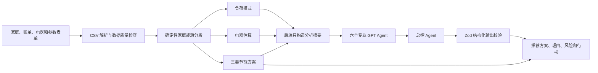
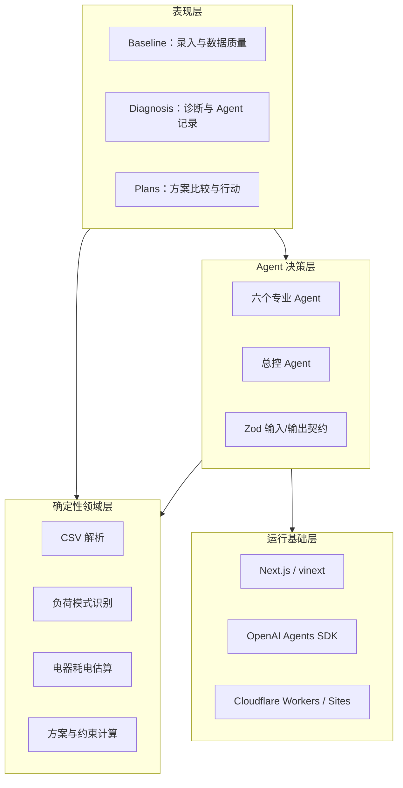

# HomeShift AI


> **降低账单，不牺牲舒适。**
> 一个使用真实家庭数据、确定性能源计算和实时多 Agent 协作生成节能方案的双语演示系统。

HomeShift AI 面向家庭用能诊断场景：用户输入家庭、账单、舒适度和主要电器信息，再导入 7～30 天的半小时用电 CSV。系统先使用本地确定性代码完成数据质量检查、负荷特征识别、电器耗电估算和三套节能方案计算，然后调用六个专业 GPT Agent 与一个总控 Agent 进行协商，最终输出推荐方案、推荐理由、被拒绝风险和可执行行动。

本项目当前目标是跑通一个可信、可解释的真实数据 Demo，而不是建设完整商业平台。它刻意不包含账号、数据库持久化、OCR、并发调度、生产监控和智能家电自动控制。

---

## 目录

- [1. 项目解决什么问题](#1-项目解决什么问题)
- [2. Agent 到底运行在哪里](#2-agent-到底运行在哪里)
- [3. 总体逻辑与端到端流程](#3-总体逻辑与端到端流程)
- [4. 系统架构](#4-系统架构)
- [5. 数据模型与接口](#5-数据模型与接口)
- [6. CSV 导入与数据质量逻辑](#6-csv-导入与数据质量逻辑)
- [7. 确定性能源计算引擎](#7-确定性能源计算引擎)
- [8. 三套方案如何生成](#8-三套方案如何生成)
- [9. 七智能体如何协作](#9-七智能体如何协作)
- [10. 可信性与安全边界](#10-可信性与安全边界)
- [11. 核心思考与创新点](#11-核心思考与创新点)
- [12. 页面与演示流程](#12-页面与演示流程)
- [13. 运行真实家庭 Demo](#13-运行真实家庭-demo)
- [14. 开发、测试与部署](#14-开发测试与部署)
- [15. 当前边界与后续扩展](#15-当前边界与后续扩展)

---

## 1. 项目解决什么问题

普通家庭节能建议通常有三个问题：

1. **过于通用**：例如“少开空调”“关闭待机设备”，没有使用家庭自己的负荷曲线。
2. **数字不可追溯**：节省金额、碳排放和设备占比可能来自固定模板或模型猜测。
3. **只追求节能，没有处理约束**：没有同时考虑睡眠温度、居家办公、改造预算和家庭执行难度。

HomeShift AI 将问题拆成三个层次：

| 层次 | 要回答的问题 | 实现方式 |
| --- | --- | --- |
| 事实层 | 数据是否完整？什么时候用电最多？夜间基荷是多少？ | CSV 校验和确定性统计 |
| 估算层 | 空调、冰箱、热水和洗衣大约消耗多少？ | 透明公式并与账单总量校准 |
| 决策层 | 在预算、舒适度和目标约束下，哪套方案更合适？ | 六个专业 Agent 与总控 Agent 协商 |

因此，本项目不是让大模型“直接算电费”，而是让大模型在可靠数字和明确约束之上进行多目标决策。

---

## 2. Agent 到底运行在哪里

### 2.1 简短答案

- 页面、CSV 解析、数据质量检查、设备估算、节能公式和方案数字运行在项目代码中。
- GPT 模型推理运行在 OpenAI 服务器上，通过 `OPENAI_API_KEY` 调用。
- 本地代码定义每个 Agent 的角色、工具、输入摘要、输出结构和约束。
- 项目不包含本地大模型权重，也不会在用户电脑上训练模型。

### 2.2 六个 Agent 不是六个本地后台程序

六个专业 Agent 是六组不同的任务说明和判断职责。它们由 OpenAI Agents SDK 暴露为总控 Agent 可以调用的专业工具。运行一次诊断时，总控按照协议调用六个专业角色，再生成结构化决策。

从工程角度看：

- **“Agent 的定义和治理逻辑”在本地代码中。**
- **“语言理解、综合判断和自然语言生成”在 GPT 服务端执行。**
- **“所有能源、金额和碳排放数字”由确定性代码计算。**

这种边界使系统既能使用大模型的综合判断能力，又不会把关键数字交给概率模型自由生成。

### 2.3 本地与远程职责分工

| 能力 | 浏览器/本地代码 | OpenAI GPT 服务 |
| --- | --- | --- |
| 表单录入与双语界面 | 是 | 否 |
| CSV 读取、排序、去重和覆盖率检查 | 是 | 否 |
| 48 时段平均曲线 | 是 | 否 |
| 电器耗电估算 | 是 | 否 |
| 节省 kWh、金额、碳排放和回收期 | 是 | 否 |
| 舒适度、预算和目标约束计算 | 是 | 否 |
| 识别方案之间的权衡 | 提供结构化事实 | 是 |
| 生成推荐理由、风险和行动建议 | 否 | 是 |
| 修改确定性方案数字 | 禁止 | 禁止 |

---

## 3. 总体逻辑与端到端流程



完整运行顺序如下：

1. 用户填写家庭信息、账单、电器参数、预算、舒适温度和节能目标。
2. 用户导入半小时区间用电 CSV。
3. 浏览器解析 CSV，检查时间、数值、跨度、重复和覆盖率。
4. 本地代码立即生成预览分析，让用户先看到负荷曲线、数据质量和设备估算。
5. 点击“运行实时诊断”后，前端向 `/api/agent` 发送结构化输入。
6. 后端使用 Zod 再次校验全部输入。
7. 后端重新执行确定性分析，生成负荷摘要、设备估算、三套方案和约束。
8. 后端只把摘要发送给 GPT，不发送完整 CSV。
9. 总控 Agent 调用六个专业 Agent，综合成本、碳排放、舒适度、风险和执行难度。
10. Agent 必须返回固定 JSON 结构。
11. 后端再次验证输出，并检查推荐方案是否可行。
12. 前端显示六条工作记录，自动高亮推荐方案，并展示最终行动清单。

如果 API Key 缺失、请求无效、模型超时或结构化输出失败，流程会停留在诊断页并允许重试，不会用模拟结果伪装成功。

---

## 4. 系统架构

### 4.1 分层架构



### 4.2 关键目录和文件

```text
homeshift-ai/
├─ app/
│  ├─ api/agent/route.ts          # 实时多 Agent API、工具和总控逻辑
│  ├─ components/HomeShiftApp.tsx # 三阶段 UI、状态和交互流程
│  ├─ globals.css                 # 页面视觉与响应式样式
│  └─ layout.tsx                  # 页面和社交分享元数据
├─ lib/
│  ├─ analysis-schema.ts          # 请求与 Agent 输出的 Zod 契约
│  ├─ demo-data.ts                # 可一键重载的完整合成案例
│  ├─ energy.ts                   # CSV、统计、设备估算和方案计算核心
│  ├─ i18n.ts                     # 中英文界面文案
│  └─ types.ts                    # 领域数据类型
├─ tests/
│  ├─ energy.test.ts              # CSV、公式、约束和 Schema 测试
│  └─ rendered-html.test.mjs      # 页面与接口结构测试
└─ .openai/hosting.json           # Sites 项目及资源绑定声明
```

### 4.3 为什么前后端都执行确定性分析

前端使用同一套 `analyzeHousehold()` 生成即时预览；用户修改输入时，不需要等待 GPT 就能看到曲线和方案数字发生变化。

后端收到请求后会重新执行同一套分析，避免信任浏览器提交的“计算结果”。因此：

- 前端分析主要服务交互体验。
- 后端分析是发送给 Agent 和最终响应使用的权威结果。
- GPT 接收的是后端重新计算后的数据，而不是前端自报的结论。

---

## 5. 数据模型与接口

### 5.1 核心输入

#### 家庭资料 `HouseholdProfile`

- 家庭名称
- 住宅类型
- 居住人数
- 是否居家办公
- 月度节能目标
- 最高可接受空调温度
- 改造预算

#### 账单 `BillInput`

- 账单开始日期
- 账单结束日期
- 总用电量，单位 kWh
- 总金额，单位 SGD

电价默认由“账单总金额 ÷ 总用电量”计算，用户可以手工覆盖。

#### 电器资料 `ApplianceInputs`

- 空调数量、功率、每日使用时长、当前温度
- 冰箱年耗电量、替换成本
- 热水器功率、每日使用分钟数
- 洗衣机单次耗电量、每周次数
- 其他设备月耗电量

#### 分析参数 `AnalysisParameters`

- 电价：SGD/kWh
- 电网排放因子：kg CO₂/kWh

### 5.2 Agent 请求

`POST /api/agent`

```json
{
  "locale": "zh",
  "profile": {},
  "bill": {},
  "appliances": {},
  "parameters": {},
  "loadPoints": []
}
```

后端不接受由前端计算好的方案数字，而是根据这些原始结构化输入重新计算。

### 5.3 成功响应

```json
{
  "mode": "live",
  "model": "gpt-5.6-terra",
  "quality": {},
  "patterns": {},
  "applianceEstimates": [],
  "insights": [],
  "plans": [],
  "decision": {
    "recommendedPlanId": "balanced",
    "rationale": [],
    "rejectedRisks": [],
    "nextActions": [],
    "specialistFindings": []
  },
  "trace": []
}
```

### 5.4 失败响应

| 错误码 | 含义 | 页面行为 |
| --- | --- | --- |
| `invalid_input` | 请求或家庭数据未通过校验 | 阻止分析，提示检查数据 |
| `configuration_missing` | 未配置 `OPENAI_API_KEY` | 停留在诊断页 |
| `agent_failed` | 模型调用、工具协作或输出校验失败 | 显示错误并允许重新运行 |

前端设置 120 秒超时。任何失败都不会自动切换成模拟 Agent。

---

## 6. CSV 导入与数据质量逻辑

### 6.1 数据语义

CSV 中每一行必须表示“该半小时区间内消耗了多少 kWh”。

系统不接受：

- 累计电表读数
- kW 瞬时功率
- 非半小时时间点
- 负数或非数字能耗

### 6.2 支持格式

支持逗号、分号和制表符分隔。

时间列别名：

- `timestamp`
- `datetime`
- `date_time`
- `time`

用电列别名：

- `kwh`
- `consumption`
- `usage`
- `energy`

示例：

```csv
timestamp,kwh
2026-07-01 00:00,0.182
2026-07-01 00:30,0.176
2026-07-01 01:00,0.169
```

没有显式时区的日期按 `Asia/Singapore`，即 UTC+08:00 解析；带有 `Z` 或时区偏移的 ISO 时间也可以读取。

### 6.3 解析规则

1. 移除 UTF-8 BOM 和空行。
2. 自动识别分隔符。
3. 标准化列名并匹配别名。
4. 验证时间和非负 kWh。
5. 验证时间必须对齐到整点或半点。
6. 按完整时间排序。
7. 遇到重复时间时保留最后一条，并记录重复数量。
8. 根据首尾日期计算应有记录数。

### 6.4 数据质量指标

```text
应有记录数 = 覆盖日历天数 × 48
缺失记录数 = 应有记录数 − 有效记录数
覆盖率 = 有效记录数 ÷ 应有记录数
```

准入规则：

- 数据跨度必须为 7～30 个日历日。
- 覆盖率低于 80%：禁止分析。
- 覆盖率为 80%～95%：允许分析，但显示警告并降低置信度。
- 覆盖率达到 95%：正常分析。

### 6.5 为什么账单和 CSV 分工不同

- **账单总 kWh 是月度规模基线。**
- **CSV 用于识别一天中什么时候用电、晚间占比和夜间基荷形状。**

7 天或 14 天 CSV 不一定与一个完整账单周期完全重合，因此系统没有强行把 CSV 总量当作月账单。这样既使用了真实负荷形状，又避免因时间范围不同产生错误的月度外推。

### 6.6 48 时段平均曲线

系统把多日数据按一天 48 个半小时时段分组，并计算每个时段的平均 kWh：

```text
00:00 的平均值 = 所有日期 00:00 记录的平均值
00:30 的平均值 = 所有日期 00:30 记录的平均值
……
23:30 的平均值 = 所有日期 23:30 记录的平均值
```

这样可以抑制单日异常，更清楚地展示家庭的重复性用电模式。

---

## 7. 确定性能源计算引擎

所有核心数字都位于 `lib/energy.ts`，不由 GPT 自由生成。

### 7.1 负荷模式

系统把时段分成：

- 夜间：00:00～05:59
- 日间：06:00～17:59
- 晚间：18:00～23:59

从真实 CSV 计算：

- 多日平均负荷峰值时段
- 晚间用电占比
- 夜间平均半小时负荷
- 夜间第 20 百分位目标
- 夜间月度潜在削减量
- CSV 期间的日均用电

夜间潜力公式：

```text
夜间潜在月节省
= max(夜间平均半小时kWh − 夜间第20百分位kWh, 0)
× 每晚12个半小时
× 30天
```

这里使用家庭自身较低的夜间观测值作为目标，而不是使用一个通用家庭基荷标准。

### 7.2 电器耗电估算

#### 空调

```text
空调月耗电
= 数量 × 单台额定功率kW × 每日小时
× 30 × 0.65
```

`0.65` 是 Demo 中使用的平均负载系数，用于反映空调压缩机并非始终满功率运行。

#### 冰箱

```text
冰箱月耗电 = 标签或申报年耗电量 ÷ 12
```

#### 热水器

```text
热水器月耗电
= 额定功率kW × 每日分钟 ÷ 60 × 30
```

#### 洗衣机

```text
洗衣机月耗电
= 单次kWh × 每周次数 × 52 ÷ 12
```

#### 其他设备

其他设备直接使用用户申报的月耗电量。

### 7.3 与账单校准

设备估算与账单总量可能不一致：

- 如果设备估算总量低于账单，差额加入“其他 / 未归因”。
- 如果设备估算总量高于账单，所有设备按同一个比例缩放到账单总量。
- 归一化状态和每个设备的计算依据会在界面中显示。

这避免出现“设备分项之和大于家庭总账单”的不合理结果，同时不假装估算就是精确的分项计量。

### 7.4 洞察与置信度

系统只输出有明确数据依据的三类洞察：

1. 峰值时段与晚间占比。
2. 夜间平均基荷和潜在削减范围。
3. 估算耗电最高的设备。

证据被标记为：

- `measured`：直接来自 CSV。
- `estimated`：来自用户申报和设备公式。
- `tool-calculated`：来自确定性成本或碳排放工具。

实测洞察置信度主要由 CSV 覆盖率决定；设备估算置信度在覆盖率基础上进一步折减，并设置上限，避免把设备推算表述为精确测量。

### 7.5 金额和碳排放

```text
节省金额 = 节省kWh × 当前电价
碳减排 = 节省kWh × 当前电网排放因子
```

电价和排放因子均来自本次用户输入。GPT 可以讨论这些结果，但不能修改它们。

---

## 8. 三套方案如何生成

三个方案 ID 固定，具体数字随家庭数据变化。

| 方案 | ID | 核心取向 | 默认购置成本 |
| --- | --- | --- | --- |
| 最大节省 | `money` | 使用完整舒适温度空间和较强的无购置行动 | 0 |
| 平衡方案 | `balanced` | 保护睡眠与工作习惯，优先低执行难度 | 0 |
| 低碳方案 | `carbon` | 在平衡方案上增加冰箱替换和空调维护 | 用户填写的冰箱替换成本 |

### 8.1 空调节省

基本假设：

```text
温度每提高1°C，节省空调估算耗电的6%
```

- 平衡方案最多提高 1°C，并只计算入睡 90 分钟后的使用时段。
- 最大节省方案最多提高 2°C。
- 任何方案都不得超过用户填写的最高舒适温度。

### 8.2 夜间基荷

- 平衡方案采用夜间潜力的 50%。
- 最大节省方案采用夜间潜力的 80%。
- 行动描述要求选择性关闭待机设备，并保留居家办公所需设备。

### 8.3 洗衣

- 平衡方案按洗衣估算耗电的 15% 计算。
- 最大节省方案按 25% 计算。
- 节省依据是冷水洗等实际能耗变化。
- 单纯把洗衣时间移动到其他时段不计算为总用电节省。

### 8.4 低碳附加行动

低碳方案在平衡行动之上增加：

- 冰箱估算耗电的 25% 替换潜力。
- 空调估算耗电的 3% 维护潜力。

### 8.5 硬约束

每套方案都包含：

- `feasible`：是否满足预算。
- `constraintNotes`：预算、舒适温度和居家办公约束说明。
- `meetsTarget`：是否达到用户节能目标。

额外保护：

```text
单个方案月节省 ≤ 账单月用电量的30%
单项节省不得为负
超预算方案可以展示，但 Agent 不得推荐
```

方案上限不是为了预测更漂亮，而是为了避免将多个估算潜力简单相加后产生不可信的过度节省。

---

## 9. 七智能体如何协作

### 9.1 六个专业 Agent

| Agent | 核心职责 | 允许使用的依据 |
| --- | --- | --- |
| Consumption Detective | 识别可重复负荷模式 | 实测负荷摘要和数据质量 |
| Appliance Auditor | 审计设备估算与归一化 | 设备公式和估算结果 |
| Cost Optimizer | 比较电费、目标和回收期 | 确定性方案与成本工具 |
| Comfort Guardian | 审查舒适度、预算和居家办公约束 | 用户约束与方案可行性 |
| Carbon Analyst | 比较碳排放结果 | 确定性方案与碳计算工具 |
| Plan and Action Coach | 把决策转成可观察的家庭行动 | 已确认的可行方案 |

### 9.2 总控 Agent

总控 Agent `HomeShift Orchestrator` 负责：

1. 按协议调用六个专业 Agent。
2. 综合不同目标之间的权衡。
3. 只在 `feasible = true` 的方案中推荐。
4. 返回推荐理由、被拒绝风险和下一步行动。
5. 返回六条专业发现，用于前端工作记录。

总控收到的是：

- 家庭和约束
- 账单
- 分析参数
- 数据质量摘要
- 负荷模式摘要
- 电器估算
- 三套确定性方案
- 明示的计算假设

总控不会收到完整半小时 CSV。这减少了传输数据量、模型上下文和不必要的家庭行为细节暴露。

### 9.3 两个确定性工具

成本 Agent 和碳排放 Agent 可以调用：

- `calculate_energy_cost`
- `calculate_carbon_impact`

工具使用本次家庭配置的电价和碳排放因子。即使 Agent 需要补充计算，也必须通过工具，而不能自行编造数字。

### 9.4 结构化输出

总控输出使用 Zod `outputType`：

```text
recommendedPlanId
rationale[1..3]
rejectedRisks[0..3]
nextActions[1..7]
specialistFindings[恰好6条]
```

后端还会验证：

- 六个专业 Agent 名称不重复且全部覆盖。
- 推荐方案存在。
- 推荐方案满足 `feasible = true`。

这使 Agent 输出能够被程序可靠读取，而不是依赖从一段自由文本中猜测推荐结果。

---

## 10. 可信性与安全边界

### 10.1 数字治理

系统采用“确定性计算，概率性决策”的边界：

```text
代码决定：多少kWh、多少钱、多少碳、是否超预算
Agent决定：在多个可行方案中，哪个更适合以及为什么
```

Agent 不能新增第四套方案，不能改写节省数字，也不能推荐超预算方案。

### 10.2 证据分级

页面明确区分：

- 实测数据
- 用户申报后的估算
- 工具计算

这避免把“空调耗电估算”误写成“智能电表直接测得的空调耗电”。

### 10.3 失败关闭

实时 GPT 是本 Demo 的必要环节，因此系统不做静默降级：

- 没有 Key：失败。
- Agent 超时：失败。
- 输出不符合 Schema：失败。
- 六个专业发现不完整：失败。
- 推荐不可行方案：失败。

失败时页面保留已完成的确定性诊断，但不会允许用户把模拟 Agent 结果当成真实协商结果。

### 10.4 人在回路

系统只给出建议：

- 不连接智能插座。
- 不自动修改空调温度。
- 不自动关闭任何设备。
- 所有家庭行动需要用户确认。

### 10.5 数据最小化

- 账单和标签图片只在浏览器显示文件名。
- 本轮不上传、不保存、不 OCR 识别这些文件。
- 完整 CSV 不发送给 GPT，只发送确定性摘要。
- 当前单家庭 Demo 不调用会话、上传和 Check-in 持久化接口。

---

## 11. 核心思考与创新点

### 11.1 确定性计算与生成式决策解耦

这是本项目最重要的设计。

如果让 GPT 直接读取 CSV、估算设备占比并生成节省金额，输出虽然流畅，但难以复核。HomeShift AI 把数值计算变成可测试的纯函数，只让 Agent 处理多目标权衡和语言解释。

价值在于：

- 数字可追溯。
- 更换模型不会改变公式。
- 每项金额和碳排放都能复算。
- Agent 幻觉不会直接污染能源指标。

### 11.2 “事实—估算—决策”三级证据链

系统没有把所有数据放在同一个可信度层级：

```text
真实CSV事实
    ↓
设备公式估算
    ↓
约束下的方案决策
```

每条 Agent 工作记录还带有 `measured`、`estimated` 或 `tool-calculated` 标签。用户可以知道某个结论究竟来自仪表数据、设备推算还是计算工具。

### 11.3 使用家庭自身建立夜间目标

传统方案可能使用“典型家庭夜间基荷”作为统一标准。本项目使用该家庭夜间数据的第 20 百分位作为目标：

- 不需要额外外部基准库。
- 更符合家庭自己的设备底噪。
- 避免把不同住宅、人数和作息强行比较。

### 11.4 账单规模与负荷形状分离

月账单负责回答“这个家庭一个月用了多少”，短周期 CSV 负责回答“这些电在什么时候使用”。

这是一个看似简单但非常关键的建模选择，可以避免：

- 7 天数据直接乘四造成误差。
- CSV 和账单周期不一致。
- 现场 Demo 因数据跨度不同而出现基线冲突。

### 11.5 约束先于推荐

预算、舒适温度、居家办公和目标不是推荐后的附加说明，而是在方案生成和 Agent 推荐前就进入数据结构。

超预算方案仍可展示其潜力，但被标记为不可行，总控 Agent 无权推荐。这比让模型在自然语言中“记得考虑预算”更可靠。

### 11.6 多 Agent 不是为了增加角色数量

六个专业角色的价值在于把冲突目标显式化：

- Cost Optimizer 希望最大化节省。
- Comfort Guardian 保护睡眠和工作。
- Carbon Analyst 关注能源与碳。
- Action Coach 关注是否真的能执行。

最终推荐必须体现这些目标之间的权衡，而不是由一个长 Prompt 同时扮演所有角色。

### 11.7 结构化协商记录

系统不展示模型隐藏思维链，而是展示可以交付给用户的：

- 专业 Agent 执行了什么任务
- 得到了什么结论
- 使用了哪一类证据
- 总控为什么推荐
- 哪些风险导致其他方案没有被选择

这提供的是可审计结论，不是不可控的内部推理文本。

### 11.8 面向真实 Demo 的最小闭环

项目没有为了“看起来像正式产品”而堆叠数据库、账号、OCR 和异步队列。它保留了真正决定 Demo 是否可信的部分：

- 真实输入
- 严格数据质量
- 动态计算
- 实时 GPT
- 可解释结果
- 失败阻断

这是面向一次真实家庭演示的最小充分架构。

---

## 12. 页面与演示流程

页面只有三个阶段。

### 12.1 Baseline / 基线

用户完成：

- 家庭与约束填写
- 账单和计算参数填写
- 主要电器填写
- CSV 导入
- 本地证据文件选择
- 数据质量检查
- 负荷曲线预览

页面保留“重新载入合成案例”，用于演示前彩排。

### 12.2 Diagnosis / 诊断

页面展示：

- 实时 Agent 状态
- 六个专业 Agent 工作记录
- 峰值、晚间占比和日均用电
- 三条确定性洞察
- 电器月度耗电估算
- Agent 调用失败后的具体错误和重试按钮

只有实时 Agent 成功后，才能进入方案比较。

### 12.3 Plans / 方案

页面展示：

- 三套动态方案
- 月节省 kWh
- 月度和年度节省金额
- 碳减排
- 前期成本和回收期
- 舒适度和执行难度
- 是否满足目标
- 是否可行
- 总控推荐理由
- 被拒绝风险
- 下一步行动

用户可以选择方案，但页面不会控制任何真实设备。

---

## 13. 运行真实家庭 Demo

### 13.1 准备数据

必须准备：

1. 家庭基本信息。
2. 最近一期账单周期、总 kWh 和总金额。
3. 7～30 天半小时 kWh CSV。
4. 空调、冰箱、热水器和洗衣机的基本参数。
5. 预算、舒适温度和目标节能比例。

可选准备：

- 账单图片或 PDF。
- 电器标签照片。

这些图片只作为现场证据文件名展示，实际数值仍需手工录入。

### 13.2 推荐演示步骤

1. 先用“重新载入合成案例”完成一次彩排。
2. 切换中英文，确认现场使用语言。
3. 填写真实家庭数据。
4. 导入真实 CSV，检查日期范围、记录数和覆盖率。
5. 向观众说明曲线来自 CSV，月度规模来自账单。
6. 展示电器估算公式和未归因部分。
7. 运行实时七智能体诊断。
8. 展示六个 Agent 的不同职责和证据类型。
9. 对比三套方案的成本、舒适和碳排放权衡。
10. 选择方案并展示最终行动。

### 13.3 最低成功标准

- 更换 CSV 后，峰值、晚间占比和基荷会变化。
- 更换设备参数后，设备估算和方案数字会变化。
- 更换电价和碳因子后，金额与碳排放会变化。
- 更换预算后，低碳方案可行性可能变化。
- 更换舒适温度后，空调行动和节省量会变化。
- GPT 推荐和六条工作记录来自本次实时响应。
- 没有 API Key 或调用失败时不能进入方案页。

---

## 14. 开发、测试与部署

### 14.1 技术栈

- TypeScript
- React 19
- Next.js 兼容的 vinext
- Recharts
- OpenAI Agents SDK
- Zod
- Cloudflare Workers
- OpenAI Sites

### 14.2 本地环境

要求 Node.js `>=22.13.0`。

```powershell
npm install
Copy-Item .env.example .env.local
npm run dev
```

环境变量：

```env
OPENAI_API_KEY=
OPENAI_MODEL=gpt-5.6-terra
```

- `OPENAI_API_KEY`：实时多 Agent 必需。
- `OPENAI_MODEL`：可选，未配置时默认使用 `gpt-5.6-terra`。

不要把真实 API Key 提交到 Git。

### 14.3 检查命令

```powershell
npx tsc --noEmit
npm run lint
npm test
```

`npm test` 当前包括：

- 生产构建
- CSV 标准列名和别名
- 逗号、分号和制表符
- 时间排序与重复处理
- 非法值、跨度和覆盖率拒绝
- 48 时段平均曲线
- 四类设备公式
- 未归因和超额归一化
- 方案上限与预算约束
- 电价和碳因子影响
- Agent 请求和结构化输出 Schema
- 页面关键内容和实时 Agent 接口结构

### 14.4 部署说明

项目包含 `.openai/hosting.json`，用于记录 Sites 项目 ID 以及逻辑 D1、R2 绑定：

- `DB`
- `UPLOADS`

这两个资源由早期原型保留，当前真实家庭单次 Demo 流程不使用数据库、上传持久化或 Check-in。

部署环境必须单独配置 `OPENAI_API_KEY`。本地 `.env.local` 不会自动成为生产环境变量。

---

## 15. 当前边界与后续扩展

### 15.1 当前明确不做

- 多用户账号和权限
- 家庭历史记录数据库
- 账单 OCR
- 电器标签视觉识别
- 智能电表自动拉取
- 实施后自动验证
- 消息队列和异步任务
- 大规模并发
- 自动控制智能家电
- 模型训练和微调
- 正式生产监控与安全审计

### 15.2 当前模型限制

- 电器分项是工程估算，不是 NILM 非侵入式负荷分解。
- 空调 `0.65` 负载系数和每升高 1°C 节省 `6%` 是 Demo 假设。
- 夜间第 20 百分位代表可达到基荷，不保证所有差额都来自可关闭设备。
- 冰箱替换和空调维护潜力是保守模板，不替代设备实测。
- 天气、季节、外出和入住变化尚未进入模型。
- 当前没有实施后数据，因此方案代表预测潜力，不代表已验证节省。

页面和 README 会把这些结果称为“估算”或“潜力”，不会表述成已实现收益。

### 15.3 推荐扩展顺序

如果以后从 Demo 扩展，建议依次增加：

1. 实施后 CSV 导入和前后对比。
2. 天气、工作日和假日归一化。
3. 更细的电器档案和设备模型。
4. 真实电价时段或动态费率。
5. 用户确认和行动完成记录。
6. 多家庭持久化和权限。
7. OCR 与电器标签识别。
8. 智能设备集成。

这些扩展可以继续沿用当前核心原则：**数据和公式负责事实，Agent 负责受约束的决策，人负责最终行动。**

---

## 项目总结

HomeShift AI 的重点不是“用了七个 Agent”，而是建立了一条可信的家庭能源决策链：

```text
真实输入
→ 数据质量
→ 可复算的能源模型
→ 受预算和舒适度约束的方案
→ 多 Agent 权衡
→ 结构化推荐
→ 用户确认行动
```

它展示了一种适合高可信场景的生成式 AI 架构：让大模型处理复杂权衡和沟通，让确定性代码守住数字、约束和可验证性。
