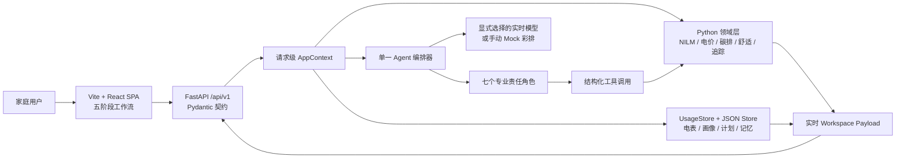

<div align="center">

<h1>HomeShift AI</h1>

<p><strong>Real data. Coordinated agents. Verifiable action.</strong></p>

<p>
面向真实家庭能源数据的智能体协作系统<br/>
Agentic AI + Household Energy Copilot
</p>


</div>

HomeShift AI 不是一个带聊天框的电费仪表盘。它接入家庭总表、天气和舒适偏好，
用确定性 Python 工具完成用电分解、费用与碳排计算，再由一个编排器协调七个专业
角色完成解释、取舍、计划和复盘。

最终目标是让普通家庭能够回答三个问题：

1. **电为什么高？**
2. **哪些行动真的值得做，而且不会牺牲舒适？**
3. **实施后究竟有没有节省，还是只是天气变了？**

当前版本面向课程展示和单家庭真实数据 Demo，完整跑通：

```text
数据接入 → 家庭画像 → 基线 → Agent 诊断 → 行动协商 → 用户确认 → 追踪与记忆
```

Python 是所有业务数字的唯一事实来源。React 只负责交互和可视化，不复制能源公式，
LLM 也不能修改 kWh、金额、碳排或追踪结果。

---

## 项目亮点

| 能力 | HomeShift AI 的实现 |
| --- | --- |
| 真实数据接入 | UCI 公开家庭数据、SP Group CSV、通用 CSV 和可重复生成的合成家庭 |
| 数据与天气对齐 | 半小时重采样、单位换算、质量检查，以及 Open-Meteo / data.gov.sg 天气 |
| 家庭负荷诊断 | 六类 NILM 分解、48 时段平均曲线、逐日用电与天气、证据与局限说明 |
| Agent 协作 | 单编排器协调七个职责角色，每次工具调用都有角色归属和本次运行 Trace |
| 舒适约束 | Comfort Guardian 拥有硬否决权，不合适的行动不会被伪装成“最佳方案” |
| 人在回路 | Agent 只能提出草案，用户确认后才会保存正式计划和版本 |
| 效果追踪 | 同时支持显式标记的合成快进和真实实施后 CSV |
| 可信复盘 | 比较基线、天气归一化预期与实际用电，并标记不可测量或不可信归因 |
| 长期记忆 | 只保存结构化、可解释的可靠结论，而不是无限增长的聊天记录 |
| 多模型 | DeepSeek、OpenAI、Claude、Qwen、Kimi、GLM、Ollama 和自定义兼容端点 |
| 完整 Web Demo | FastAPI + Vite React SPA，中英文切换、阶段引导、工作动画、Trace、Chat 和 HTML 报告 |

---

## 五阶段产品闭环

### 01 · Data / 数据接入

- 选择 UCI、SP Group、通用 CSV 或合成家庭。
- 识别时间列、用电列和单位，支持 kWh、Wh、kW、W。
- 选择 Open-Meteo、data.gov.sg 或不使用天气。
- 展示来源、许可、日期范围、完整度、缺失时段和已知局限。
- 审核系统从负荷曲线推断的家庭画像、节能目标和舒适约束。

重新导入家庭数据需要明确确认。确认后会清空旧诊断、计划、追踪、复盘、记忆和
Agent Trace，避免不同家庭的数据串线。

### 02 · Baseline / 基线

- 月度折算用电、日均用电、账单和碳排放。
- 一天 48 个半小时时段的平均负荷形状。
- 逐日用电与温度叠加图。
- 高低用电日、峰值时段、证据文件和数据质量提示。
- 币种、电价和碳因子跟随当前地区配置。

页面中的指标来自当前 Python 工作空间，并在每次导入后重新计算，不是静态截图。

### 03 · Diagnosis / 诊断

- Python 先生成确定性基线、NILM 和证据摘要。
- Agent 再读取画像、用电、天气、电价、碳因子和负荷分解结果进行解释。
- 页面展示六类负荷、前三项发现、计算周期、方法边界和置信依据。
- 有分表真值时展示误差；没有真值时明确说明无法定量验证。
- 本次工具调用按顺序形成可审计 Trace。

模型运行期间，页面会显示当前阶段、已等待时间和正在处理的任务。动画用于解释正在
执行的请求，不伪造后端流式事件；完成状态和 Trace 只以 API 实际返回为准。

### 04 · Plan / 计划

- 展示全部候选行动，而不是人为制造三套固定套餐。
- 每项行动包含节省 kWh、费用、CO₂、难度和舒适影响。
- 单独展示被 Comfort Guardian 否决的行动、理由和主动放弃的收益。
- Agent 推荐项默认选中，用户可以增删。
- `plan/propose` 只产生不落盘的草案。
- 只有用户点击确认，`plan/commit` 才生成正式版本和七日执行表。

### 05 · Track & Memory / 追踪与记忆

- “演示快进一周”生成有永久标记的合成实施后数据。
- “上传真实实施后 CSV”以追加模式写入，不覆盖基线和计划版本。
- 比较基线、天气归一化预期和实际用电。
- 计算总体节省、达成率和分行动可信度。
- 对异常结果标记 `not_measurable` 或 `implausible`，不包装成超额成功。
- Review Agent 形成下周建议，并把可靠洞察写入长期记忆。

前后端共同执行顺序约束：未完成 Agent 诊断不能进入 Plan，未提交正式计划不能进入
Track，没有实施后数据不能运行 Review。

---

## 系统架构



### 事实与决策的边界

| 层 | 负责什么 | 不负责什么 |
| --- | --- | --- |
| React SPA | 输入、状态引导、图表、Trace、Chat、报告入口 | 不计算业务数字，不保存 API Key |
| FastAPI | 请求校验、顺序约束、模型路由、工作空间组装 | 不复制领域公式 |
| Python 领域层 | kWh、费用、CO₂、NILM、候选收益、舒适否决、追踪 | 不生成营销式叙事 |
| Agent 编排器 | 决定下一步调用哪个工具、解释证据、协调取舍 | 不编造或覆盖工具数字 |
| LLM Provider | 语言推理和结构化工具选择 | 不直接写入正式计划 |

### 为什么不是七个相互聊天的模型

项目采用 **single-controller, multi-role** 架构：一个 LLM 工具循环负责调度，七个
角色定义明确的责任边界、输入、输出和工具归属。这比七个独立会话轮流输出文本更适合
能源场景：

- 所有角色共享同一份家庭事实，数字不会互相矛盾。
- 工具调用更少，延迟和成本更可控。
- 每条 Trace 都能回答“谁调用了什么工具、看到了什么证据”。
- Comfort Guardian 的否决权可以在系统层执行，而不只是提示词建议。

---

## 七个专业角色

| # | 角色 | 责任 | 关键产物 |
| --- | --- | --- | --- |
| 1 | Data Steward / 数据管家 | 收集画像、用电和天气并检查证据质量 | 基线、负荷形状、证据摘要 |
| 2 | Load Detective / 负载侦探 | 将家庭总表拆分为设备类别，并说明误差 | NILM 分类和方法边界 |
| 3 | Cost Analyst / 成本分析师 | 按本地电价将 kWh 转换为费用 | 账单与行动节省金额 |
| 4 | Carbon Analyst / 碳排分析师 | 按本地排放因子计算 CO₂ | 基线与行动碳排 |
| 5 | Comfort Guardian / 舒适守门人 | 对违反锁定舒适规则的行动执行否决 | 否决理由与放弃收益 |
| 6 | Planner / 规划师 | 量化候选、提出组合并生成执行日历 | 草案、正式计划、七日安排 |
| 7 | Tracker & Memory / 追踪与记忆 | 天气归一化复盘并保存可靠洞察 | 达成率、可信度、长期记忆 |

运行以下命令可查看角色花名册，并检查是否存在没有角色认领的工具：

```powershell
python -m homeshift agents
```

---

## 快速启动

### 环境要求

- Python 3.10+
- Node.js 20.19+ 或 22.12+
- Windows PowerShell、macOS 或 Linux

### 1. 获取项目

```powershell
git clone https://github.com/HUITianYi/HomeShift-AI.git
cd HomeShift-AI
```

### 2. 启动 Python API

```powershell
python -m pip install -r requirements.txt
python -m uvicorn homeshift.api:app --host 127.0.0.1 --port 8000
```

启动后可访问：

- `http://127.0.0.1:8000`：跳转到 FastAPI 文档。
- `http://127.0.0.1:8000/docs`：交互式 API 文档。
- `http://127.0.0.1:8000/api/v1/status`：当前工作空间状态。

### 3. 启动 React SPA

另开一个终端：

```powershell
cd frontend
npm.cmd install
npm.cmd run dev
```

浏览器打开 `http://127.0.0.1:5173`。

> Windows PowerShell 如果禁止执行 `npm.ps1`，使用 `npm.cmd` 即可，不需要修改系统
> 执行策略。macOS 和 Linux 使用 `npm`。

### 4. 跑通完整 Demo

1. 在 **Data** 选择合成家庭，或导入真实 CSV。
2. 审核画像并确认舒适约束。
3. 在 **Model** 面板选择实时模型，或明确选择 Mock 彩排。
4. 依次完成 **Baseline → Diagnosis → Plan**。
5. 修改 Agent 推荐的行动并确认提交正式计划。
6. 在 **Track** 快进一周或上传真实实施后 CSV。
7. 运行天气归一化 Review，查看达成率、建议与长期记忆。

### 从干净状态重新演示

当前家庭工作空间会持久化在 `data/`，因此刷新网页后仍会看到上次运行结果。若要开始
新一轮演示，在 Data 页面重新导入数据并确认重置即可；后端会保留新基线，清除旧诊断、
计划、复盘、记忆和 Trace。

---

## 模型配置

仓库不内置任何 API Key。网页不会要求输入、保存或回显密钥，实时模型只读取启动
后端进程时已经配置的环境变量。

PowerShell 示例：

```powershell
$env:DEEPSEEK_API_KEY="your-key"
python -m homeshift providers
python -m homeshift llm-test
```

在 `config.json` 中选择提供方：

```json
{
  "llm": {
    "provider": "deepseek",
    "model": "deepseek-v4-pro"
  }
}
```

| Provider | 环境变量 | 接口类型 |
| --- | --- | --- |
| `mock` | 无 | 离线剧本；Web 中必须手动选择 |
| `deepseek` | `DEEPSEEK_API_KEY` | OpenAI-compatible |
| `openai` | `OPENAI_API_KEY` | OpenAI-compatible |
| `anthropic` | `ANTHROPIC_API_KEY` | Claude Messages API |
| `qwen` | `DASHSCOPE_API_KEY` / `QWEN_API_KEY` | OpenAI-compatible |
| `kimi` | `MOONSHOT_API_KEY` / `KIMI_API_KEY` | OpenAI-compatible |
| `zhipu` | `ZHIPU_API_KEY` / `GLM_API_KEY` | OpenAI-compatible |
| `siliconflow` | `SILICONFLOW_API_KEY` | OpenAI-compatible |
| `openrouter` | `OPENROUTER_API_KEY` | OpenAI-compatible |
| `ollama` | 通常无需 Key | 本地 OpenAI-compatible |
| `custom` | `LLM_API_KEY`，可选 | 自定义兼容网关 |

Mock 只替代“下一步调用哪个工具”的模型决策。数据处理、NILM、费用、碳排、舒适否决、
候选收益和追踪仍执行真实 Python 代码。实时模型调用失败时不会自动降级为 Mock，也不会
把失败伪装成成功。

更多配置见 [多模型 API 配置](docs/07_multi-model-api-configuration.md)。

---

## 数据来源

| 数据源 | 内容 | 适用场景 |
| --- | --- | --- |
| `synthetic` | 可重复生成的半小时家庭用电与分表真值 | 离线彩排和完整闭环演示 |
| `uci` | 法国真实单户分钟级数据，包含 3 路分表 | 公开数据研究和 NILM 定量验证 |
| `spgroup` | 用户自行导出的新加坡 SP Group CSV | 新加坡真实家庭演示 |
| `csv` | 任意时间列 + 用电列 | 接入其他地区或自有数据 |

通用 CSV 支持：

- 自动或手工指定时间列与用电列。
- kWh、Wh、kW 和 W 单位转换。
- 7～365 天窗口。
- 半小时重采样、重复与缺失检查。
- Open-Meteo、data.gov.sg 或无天气模式。

CLI 一键接入示例：

```powershell
python fetch_real_data.py --list
python fetch_real_data.py --dataset uci
python fetch_real_data.py --dataset spgroup --file data/raw/my_meter.csv
python fetch_real_data.py --dataset csv --file data/raw/home.csv --time-col timestamp --value-col kwh
```

完整说明见 [真实数据接入指南](docs/06_real-data-import-guide.md)。

---

## API 概览

| 方法 | 路径 | 作用 |
| --- | --- | --- |
| `GET` | `/api/v1/status` | 数据、地区、计划、记忆和模型状态 |
| `GET` | `/api/v1/providers` | 可用模型及配置状态，不返回密钥 |
| `PUT` | `/api/v1/settings/model` | 显式选择实时模型或 Mock |
| `GET` | `/api/v1/datasets` | 可接入的数据源 |
| `POST` | `/api/v1/datasets/import` | 下载注册数据集或上传 CSV |
| `GET/PUT` | `/api/v1/profile` | 读取和编辑家庭画像 |
| `GET` | `/api/v1/workspace` | 实时组装五阶段工作空间 |
| `POST` | `/api/v1/diagnose` | 运行本次 Agent 诊断 |
| `POST` | `/api/v1/plan/propose` | 生成不落盘的行动草案 |
| `POST` | `/api/v1/plan/commit` | 用户确认后保存正式计划 |
| `POST` | `/api/v1/tracking/simulate-week` | 生成明确标记的合成实施后数据 |
| `POST` | `/api/v1/tracking/import` | 追加真实实施后 CSV |
| `POST` | `/api/v1/review` | 天气归一化复盘和长期记忆 |
| `POST` | `/api/v1/chat` | 基于当前家庭、计划和记忆对话 |
| `GET` | `/api/v1/report` | 生成并下载 HTML 周报 |

所有错误使用统一结构：

```json
{
  "error": {
    "code": "workflow_prerequisite_missing",
    "message": "请先完成本次 Agent 诊断，再请求计划建议。",
    "details": null
  }
}
```

---

## CLI 工作流

Web SPA 是推荐的演示入口，CLI 仍保留完整领域能力：

```powershell
python -m homeshift init
python -m homeshift status
python -m homeshift diagnose
python -m homeshift plan
python -m homeshift simulate-week
python -m homeshift review
python -m homeshift report
```

其他实用命令：

| 命令 | 用途 |
| --- | --- |
| `python -m homeshift providers` | 查看模型提供方与密钥状态 |
| `python -m homeshift llm-test` | 测试模型连通性和工具调用 |
| `python -m homeshift agents` | 查看七角色与工具覆盖 |
| `python -m homeshift eval-disagg` | 用分表真值评估 NILM |
| `python -m homeshift chat` | 终端对话 |
| `python -m homeshift export-web` | 生成离线网站数据包；实时 SPA 不依赖它 |

---

## 核心设计与创新

### 1. LLM 不拥有数字

大模型擅长解释证据和协调取舍，但不适合承担可审计的能源计算。HomeShift 把语言推理
与业务计算分离：模型决定“下一步调用什么工具”，Python 决定“数字是多少”。

### 2. 舒适是硬约束，不是装饰性评分

Comfort Guardian 可以否决违反锁定舒适规则的行动。被否决项仍展示理由和放弃的收益，
让用户看见系统做了什么取舍，而不是只看一个最大节省数字。

### 3. 建议和正式计划在系统层隔离

Web 规划使用请求级代理 Store 截获 `save_plan`，只形成内存草案。正式计划必须经过
用户确认才会写入版本。这个边界由代码保证，而不是只靠提示词要求模型“不要保存”。

### 4. 不把天气变化冒充节能

复盘先计算天气归一化预期，再与实际实施后用电比较。异常的分行动达成率会被标记为
不可测量或不可信，而不是被包装成超额成功。

### 5. Trace 描述本次真实运行

API 只返回当前操作产生的 Trace。历史轨迹可以保留用于审计，但不会混入本次 Agent
工作记录。前端加载动画也不会冒充真实工具事件。

### 6. 结构化记忆，而不是无限聊天上下文

只有用户反馈和复盘产生的可靠洞察进入长期记忆。下一轮规划会读取这些结构化事实，
同时避免把所有历史对话不断塞回模型。

---

## 项目结构

```text
HomeShift-AI/
├── homeshift/
│   ├── api.py                 FastAPI 入口与 /api/v1 接口
│   ├── api_models.py          Pydantic 请求契约
│   ├── api_runtime.py         请求级上下文、阶段状态与提案隔离
│   ├── agent/
│   │   ├── core.py            Tool-use 编排循环与运行 Trace
│   │   ├── roles.py           七个角色、工具归属与覆盖检查
│   │   ├── prompts.py         诊断、规划和复盘提示词
│   │   └── tools.py           结构化工具 Schema 与执行
│   ├── domain/
│   │   ├── disaggregate.py    NILM 负荷分解
│   │   ├── simulate.py        候选行动与节省模拟
│   │   ├── comfort.py         舒适约束和否决
│   │   ├── tracker.py         天气归一化追踪
│   │   ├── tariff.py          多币种电价
│   │   └── carbon.py          碳排换算
│   ├── llm/                   多模型注册表与协议适配
│   ├── realdata/              数据集、CSV、天气与导入流水线
│   ├── datastore/             单家庭 JSON / CSV 持久层
│   ├── datagen/               合成家庭生成器
│   ├── report/                HTML 周报
│   └── export/                离线网站数据包
├── frontend/
│   ├── src/App.tsx            五阶段产品流程与全局抽屉
│   ├── src/api.ts             API 客户端和 Zod 响应契约
│   ├── src/styles.css         响应式视觉系统
│   └── e2e/                   Playwright 完整流程
├── tests/                     Python 领域与 API 测试
├── docs/                      架构、操作、数据和演示文档
├── fetch_real_data.py         CLI 真实数据入口
└── requirements.txt
```

---

## 测试与验证

```powershell
# Python 领域层与 API
python -m unittest -v

# Frontend
cd frontend
npm.cmd run lint
npm.cmd test
npm.cmd run build

# 完整五阶段 E2E
npm.cmd run test:e2e
```

Playwright 使用临时工作空间，不会修改当前 `data/` 中的真实家庭、计划或记忆。流程覆盖
阶段锁定、工作动画、显式 Mock、数据导入、Agent 诊断、行动提案、用户提交、合成快进
和天气归一化复盘。

---

## 项目边界

这是一个完整的本地 Demo，而不是生产能源平台。当前有意不实现：

- 账号、权限和多租户。
- 云数据库、对象存储和任务队列。
- OCR 账单或电器标签识别。
- 自动控制真实家电。
- 大规模并发、生产监控和告警。
- 把 NILM 估算包装成分表真值。

当前工作空间只保存一个家庭。模拟数据和真实数据始终使用不同标记；没有分表真值时，
系统会明确说明 NILM 无法定量验证。

---

## 文档

| 文档 | 内容 |
| --- | --- |
| [系统架构与 Agent 原理](docs/02_architecture-and-agent-principles.md) | 编排器、七角色、工具归属和确定性边界 |
| [操作手册](docs/03_user-guide.md) | 环境准备和完整五阶段使用流程 |
| [演示脚本与答辩 Q&A](docs/05_demo-script-and-defense-qa.md) | 现场演示节奏、讲解重点和常见问题 |
| [真实数据接入指南](docs/06_real-data-import-guide.md) | UCI、SP Group、通用 CSV 与天气 |
| [多模型 API 配置](docs/07_multi-model-api-configuration.md) | Provider、环境变量、模型切换与排错 |
| [网站数据对接说明](docs/08_web-data-integration.md) | 离线导出契约 |
| [Presentation 建议](docs/09_presentation-guide.md) | 汇报结构与幻灯片重点 |

---

## FAQ

### 数据是真的吗？

可以是真的，也可以是明确标记的合成数据。UCI 和用户上传的 CSV 属于真实数据，
`data/provenance.json` 记录来源、质量和局限；合成数据用于无网络彩排。

### 没有 API Key 能演示吗？

可以。手动选择 Mock 后，工具执行和业务计算仍是真实的，只有工具调用顺序由离线剧本
决定。仓库不包含任何内置密钥。

### 为什么刷新网页后还看到上一次结果？

单家庭工作空间会持久化在 `data/`。这保证演示中途刷新不会丢失进度。需要全新演示时，
在 Data 页面重新导入并确认重置即可。

### 为什么节省数字可信？

候选行动、费用、碳排和追踪均由 `homeshift/domain/` 中的确定性代码生成。Agent 只读取
和解释结果，不能修改数字；实施后还会用天气归一化结果验证预测。

### 系统会自动控制家电吗？

不会。HomeShift 提供建议、正式计划和复盘，所有行动都由用户确认和执行。这是刻意的
安全与产品边界。

---

<div align="center">

**HomeShift AI — cut bills, not comfort.**

</div>
